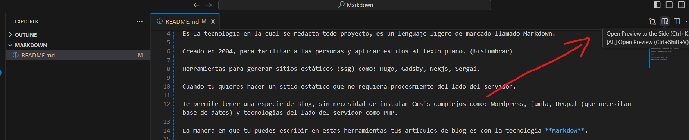
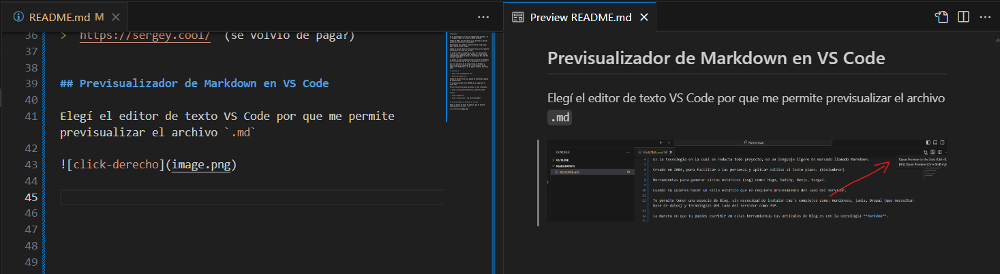

# Markdown

Es la tecnologia en la cual se redacta todo proyecto, es un lenguaje ligero de marcado llamado Markdown.

Creado en 2004, para facilitar a las personas y aplicar estilos al texto plano. (bislumbrar)

Herramientas para generar sitios estáticos (ssg) como: Hugo, Gadsby, Nexjs, Sergai.

Cuando tu quieres hacer un sitio estático que no requiera procesmiento del lado del servidor.

Te permite tener una especie de Blog, sin necesidad de instalar Cms's complejos como: Wordpress, jumla, Drupal (que necesitan base de datos) y tecnologias del lado del servidor como PHP.

La manera en que tu puedes escribir en estas herramientas tus artículos de blog es con la tecnologia **Markdow**.

eje: los articulos de mi blog lo hago en Markdown y posteriormente es compilado por la herramienta (Ssg = static site Generatos) y ya me genera archivos estáticos html

**_recursos_**

> `https://www.markdownguide.org/`

> `https://dillinger.io/`

Github te permite crear una página de bienvenida (página de presentacion)

El archivo principal es el README.md al igual que el index.html

Mira el curso de Dom para aprovechar el SSG y Markdown.

> `https://youtu.be/MtvjOftAsnA?si=o_yMCFoT2i_4sIAA`

**Ssg**:

> `https://gohugo.io/`

> `https://sergey.cool/` (se volvio de paga?)


## Previsualizador de Markdown en VS Code

Elegí el editor de texto VS Code por que me permite previsualizar el archivo `.md`



y se vé así la vista previa:



_Markdown_ (Cursiva porr que es una palabra ajena a nuestro idioma)

## Párrafos

Esto es un parrafo

La doctora Ana Martínez, una reconocida neuróloga, dedicaba sus días a investigar nuevas terapias para enfermedades neurodegenerativas. En su pequeño pero avanzado laboratorio, Ana y su equipo trabajaban incansablemente, buscando respuestas en los intrincados caminos del cerebro humano. Su pasión por la medicina nació cuando era niña, inspirada por su madre, también doctora, quien le enseñó el valor de la empatía y la dedicación. Cada paciente que atendía era una oportunidad para marcar la diferencia, y Ana no descansaba hasta encontrar la mejor solución para cada caso. Su compromiso y su calidez humana la convirtieron en una figura querida y respetada tanto por sus colegas como por sus pacientes.

(DAR ENTER PARA UN PARRAFO)

## Cursiva y Negrita

para mostrar letra **_Cursiva_**, escribe así: 

> `_Cursiva_`

para mostrar letra **negrita**, escribe así: 

> `**negrita**`

para mostrar ambas: **_Cursiva y negrita_**, escribe así: 

> `**_Cursiva y negrita_**`

## Encabezados

> `# encabezado 1` 

> `## encabezado 2`

> `### encabezado 3`

> `#### encabezado 4`

> `##### encabezado 5`

> `###### encabezado 6`

(despues del `# ...` dejamos un espacio en blanco). Solo tenemos 6 niveles como en html.

## Enlaces

Hacemos el uso de dos caracteres, un juego de corchetes y un juego de parentesis.

> `[Enlace](https://www.instagram.com/diegotvramos/)`


[Enlace](https://www.instagram.com/diegotvramos/)

**Anclas internas:**

> `[Markdown](#markdown)`

[Markdown](#markdown)

no importa el nivel de encabezado que sea, cuando quieras poner enlaces internos dentro de un documento markdown el los va reconocer como anclas internas.

Sí tu encabezdo tiene varias palabras usa los guiones (-x-x) similar a las urls amigables en la barra de busqueda, aunque Vs Code te los va completar automáticamente al seleccionar al (#) gatito:

> ``[encabezado-con-varias-palabras](#previsualizador-de-markdown-en-vs-code)`` 


[encabezado-con-varias-palabras](#previsualizador-de-markdown-en-vs-code)

## Imágenes

Esta sintaxis es muy similar a la sintaxis de los enlaces, solo aumentas el signo de admiración adelante:

imagen local:

> ````

tambien puedes usar el link de una imagen:


## Divisiones

 3 guiones medios similar a la `<hr>`:

> `---`

El resultado es una linea divisoria:

---

No solo es una linea horizontal, sementicamente significa que estás haciendo una division de contenido, quiere decir que despues de esa linea vas a hablar de otro tema.

## Listas

**Listas ordenadas:**

> `1. Primavera`

> `1. Verano`

> `1. Otoño`

Resultado (lo correcto es mantener el numero `1` por delante):

1. Primavera
1. Verano
1. Otoño

**Lista de viñetas (o tambien puede usar el `-` guion medio):**
> `* Primavera`

> `* Verano`

> `* Otoño`

Resultado:

* Primavera
* Verano
* Otoño

Recuerda, tiene que haver un espacio entre el caracter y el texto.

**Sublistas (hacemos la indentación)**
```
* Primavera
    * septiembre
        * día del peaton
    * octubre
    * noviembre
```
Resultado: 

* Primavera
    * septiembre
        * día del peaton
    * octubre
    * noviembre

## Citas

Se usa para hacer citas bibliográficas. En html `<blockquote>`

**Cita en linea**

> ``> siempre tienes opción de no tener opinión - Marco Aurelio``

Este es el resultado:

> siempre tienes opción de no tener opinión - Marco Aurelio

**Citas en bloque**

```
> Todo lo que escuchamos es una opinión, no un hecho.
>
> Todo lo que vemos es una perspectiva, no la verdad.
>
> Marco Aurelio
```

Este es el resultado:

> Todo lo que escuchamos es una opinión, no un hecho.
>
> Todo lo que vemos es una perspectiva, no la verdad.
>
> Marco Aurelio

## Tablas

vamos a utilizar el simbolo del `||`(paip)

tabla de 3 columnas

```
| Nombre | Edad | Coreo/website |
| --- | --- | --- |
| Diego | xx | diegovillacortaramos@gmail.com |
| Allie | xx | https://www.alliesherlock.com/ |
```


Las **tres guiones medios** debajo del encabezado de las tablas es fundamental para que la tabla se te forme:


| Nombre | Edad | Coreo/website |
| --- | --- | --- |
| Diego | xx | diegovillacortaramos@gmail.com |
| Allie | xx | https://www.alliesherlock.com/ |

## Códigos

Si estas redactando articulos y quieres poner ejemplos de código, vamos a hacer el uso del acento grabe ` `` `

**Bloques de código en linea**

```
Para citas más largas que requieren un bloque independiente, puedes usar la etiqueta `<blockquote>`:
```
Resultado:

Para citas más largas que requieren un bloque independiente, puedes usar la etiqueta `<blockquote>`:

**Bloques de código en bloque**

Hacemos el uso del acentro grabe 3 veces al inicio y 3 veces al final.

> ` ``` BLOQUE DE CÓDIGO``` `

Adicionalmente si ya sabes el nombre del lenguaje de programación que estas trabajando colocale despuede de los primeros 3 acentos grabes así:
>  ` ```javascript BLOQUE DE CÓDIGO``` `

resultado:

```javascript
    // Definición de la función sumar
function sumar(a, b) {
    return a + b;
}

// Llamada a la función sumar
let resultado = sumar(5, 3);
console.log("La suma es: " + resultado);

```

markdown suporta toda la escritura html (no pongas espacios o saltos de linea).

```html
    <form action="/submit" method="post">
        <label for="nombre">Nombre:</label><br>
        <input type="text" id="nombre" name="nombre" required><br><br>
        <label for="email">Correo Electrónico:</label><br>
        <input type="email" id="email" name="email" required><br><br>
        <label for="mensaje">Mensaje:</label><br>
        <textarea id="mensaje" name="mensaje" rows="4" cols="50" required></textarea><br><br>
        <input type="submit" value="Enviar">
    </form>
```

Resultado:

<form action="/submit" method="post">
        <label for="nombre">Nombre:</label><br>
        <input type="text" id="nombre" name="nombre" required><br><br>
        <label for="email">Correo Electrónico:</label><br>
        <input type="email" id="email" name="email" required><br><br>
        <label for="mensaje">Mensaje:</label><br>
        <textarea id="mensaje" name="mensaje" rows="4" cols="50" required></textarea><br><br>
        <input type="submit" value="Enviar">
    </form>

## Comentarios

los comentarios son los mismo que en html:


> ` <!-- Esto es un comentario --> `

en la previsualizacion no se vé.

## Escape de caracteres

queremos que markdown ignore el uso que le damos a estos caracteres especiales usamos la barra invertida(contrabarra) antepongo en todo los caracteres especiales que usa markdown, pues ignora su funcionamiento.

> ``\*\*negrita\*\* y \_cursiva\_``

Resultado

\*\*negrita\*\* y \_cursiva\_


> Todo esto de la programación no trates de memorizartelo, mas bien práctica y práctica y práctica. La práctica va hacer que en el cerebro (en la parte de memoria muscular), todo lo que ejercitamos constantemente se va a esa memoria muscular, de tal manera que no necesitamos memorisarlo 🤗🤗